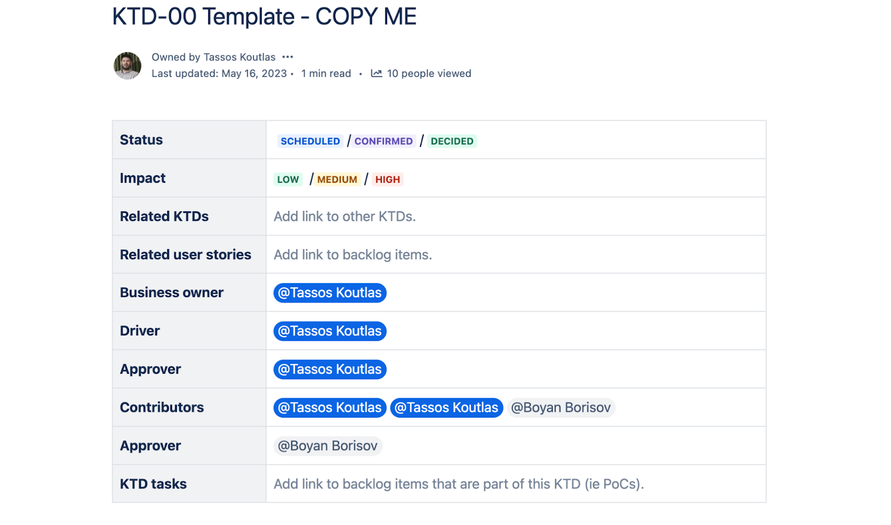
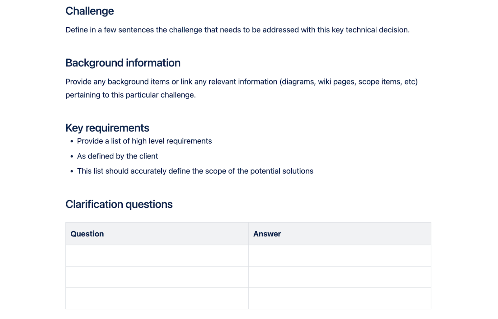
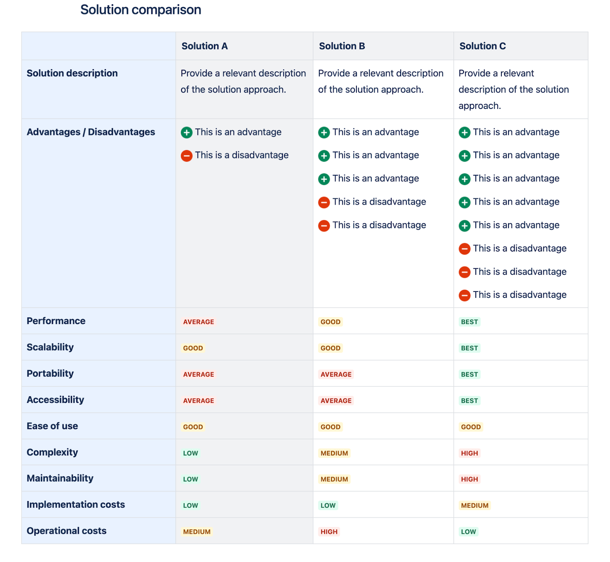
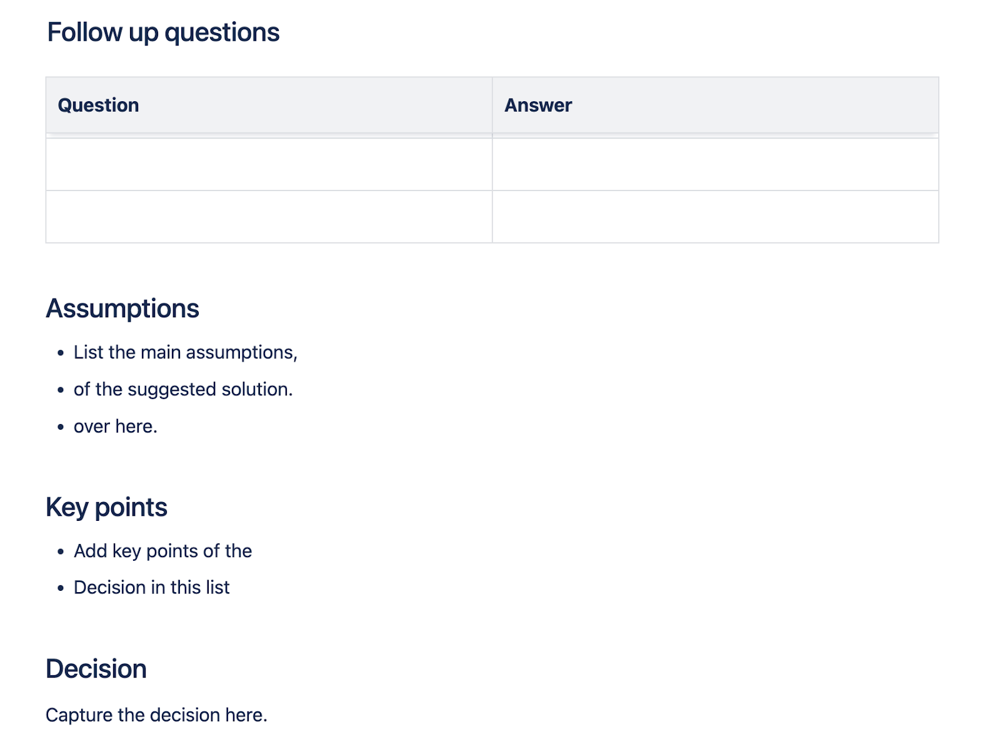
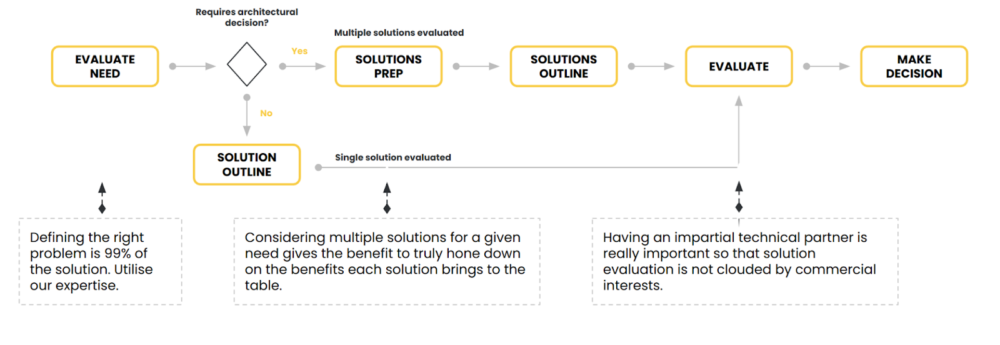
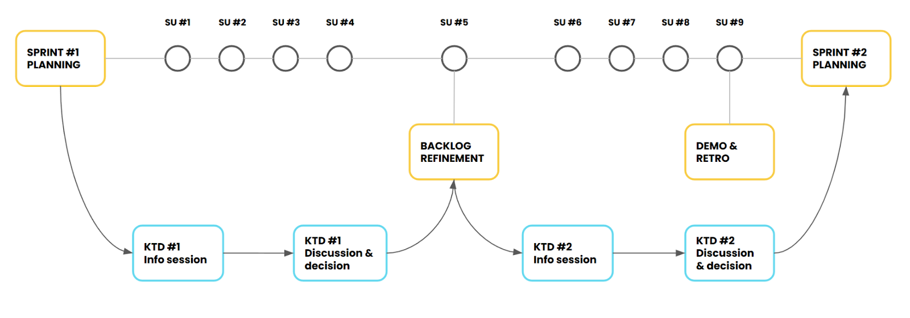
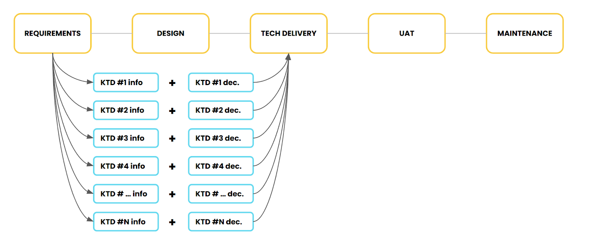

Key Technical Decisions are decisions that have profound strategic and architectural implications for the organisation.

They enable or inhibit strategic goals: evolution, growth and value creation.

KTDs offer a transformative way to consult, decide and create consensus. 

Generally a very well accepted method by teams and clients alike.

The collaborative nature of the process is not easy for everyone to follow, usually at the beginning.

## Mission

To help organisations expand, support and maintain their technical architecture and platforms  through an ever changing technical landscape in an ever growing business environment.

## Benefits

- KTDs aid organisations align their technical stack to business vision.

- KTDs enable stakeholder participation through a simple process so that all business needs are considered when making technical decisions.

- KTDs guide multiple solution exploration before technical commitments are made so that costs associated with unfit solutions are avoided and budgets are utilised better.

- KTDs define context, landscape and challenge clearly so that alignment and consensus is reached with a mutual understanding of trade offs involved.

- KTDs offer a clear audit trail for all technical decisions so that anyone can understand why each decision was made at a given point in time.

- KTDs create a lightweight governance framework to evolve technical architectures when new needs arise so that organisations can focus on growth and value creation.

## Audience and message

| Audience   | Pain points                                                                                                                                                                                                                                                                                                                                                                                                                                                                                                                                                                                                                                                                                                                                                                                                                                                                                                                                                                                                                                                                                                                                                                                                                                                                                                                                                                                                                                                                                                                                                                                                                                                                                                                                                                                                                                                                                     |
| ---------- | ----------------------------------------------------------------------------------------------------------------------------------------------------------------------------------------------------------------------------------------------------------------------------------------------------------------------------------------------------------------------------------------------------------------------------------------------------------------------------------------------------------------------------------------------------------------------------------------------------------------------------------------------------------------------------------------------------------------------------------------------------------------------------------------------------------------------------------------------------------------------------------------------------------------------------------------------------------------------------------------------------------------------------------------------------------------------------------------------------------------------------------------------------------------------------------------------------------------------------------------------------------------------------------------------------------------------------------------------------------------------------------------------------------------------------------------------------------------------------------------------------------------------------------------------------------------------------------------------------------------------------------------------------------------------------------------------------------------------------------------------------------------------------------------------------------------------------------------------------------------------------------------------- |
| CIOs/CTOs  | **Technical (scalability, integration, security) and cost management.** The technical landscape for enterprise systems is complex and costly. Iterations are slow and expensive. KTDs are a framework to funnel down the options so decisions are as precise as possible to optimise resources.  **Stakeholders alignment.** It is difficult to unify stakeholders and coordinate/integrate requirements and restrictions. KTDs bring all stakeholders to contribute, framing the conversation to reach consensus and alignment, while minimising the rogue contributions that add noise and dissent. To do that KTDs provide governance and ownership to the strategic technical planning for the business. Everyone can be part of the decision, everyone cooperates and contributes. Decisions are weighted and reasoned against the set of constraints and requirements provided by all stakeholders during the process. Finally KTDs remove future arguments and confusion due to the different ways we all remember things. They are a single source of truth.  **Innovation or value creation vs stability.** KTDs provide a way to balance the need for innovative solutions with the requirement for stable, reliable systems. More people and departments require tools and technologies that complicate the IT landscape. KTDs facilitate compiling them in a structured, but very accessible, process that brings understanding to all parties involved.  **Context (business, technical and political) not considered in strategic decisions.** If the broader context in the company is not considered when decisions are being made for the technical stack, infrastructure and platforms, the technical landscape becomes unmaintainable after a while. KTDs provide a framework to express the broad context affecting the technical solutions needed. |
| CMOs/CDOs  | **Misaligned goals.** KTDs promote alignment with departmental goals by ensuring that the technical architecture supports every stakeholders’ objectives. They are the opportunity for stakeholders to influence the architecture, becoming a true two way communication channel.  **Technical silos due to rogue technical solutions.** KTDs avoid technical silos by rightfully including the stakeholders’ requirements in the definition of the technical architecture.  **Communication breakdown.** KTDs facilitate effective communication and collaboration between IT and all the other teams.                                                                                                                                                                                                                                                                                                                                                                                                                                                                                                                                                                                                                                                                                                                                                                                                                                                                                                                                                                                                                                                                                                                                                                                                                                                                         |
| Architects | **Technology Selection.** Revisiting technical decisions made months or years earlier can be challenging, especially when trying to understand the context and reasoning behind them. KTDs offer a detailed and well-reasoned paper trail, serving as a blueprint for the technical architecture and ensuring clarity and continuity over time.  **Technical Debt.** KTDs help minimise technical debt while implementing new features and improvements by maintaining a clear perspective on business and stakeholder constraints that impact the architecture. This ensures that all decisions are aligned with broader organisational goals and limitations.  **Change Management.** Traditionally, there is little historical information to provide context to a technical architecture. KTDs bridge this gap by documenting the rationale and context behind decisions, allowing the architecture to evolve and adapt in alignment with the business.  **Newcomer/Leaver Knowledge Gap.** KTDs address the challenge newcomers face in understanding the rationale behind the existing architecture. Simultaneously, they provide an invaluable tool for maintaining professional integrity for departing team members, as their decisions and the reasons behind them are thoroughly documented.                                                                                                                                                                                                                                                                                                                                                                                                                                                                                                                                                                 |
| Developers | **Not understanding the big picture or business priorities shaping the technical architecture.** Traditionally, development and business have been two separate entities with limited communication between them. KTDs document the business reasons behind technical strategic decisions, helping stakeholders understand the decision points that extend beyond specific, tactical technical choices.  **Lack of ownership on the development required.** Usually, there is a lack of alignment with business requirements that are not well understood. KTDs help with the ownership and transparency of the technical decisions that shape the architecture. They provide a clear paper trail of choices, the reasons behind them, and the context that constrains them.  **Lack of implementation consistency.** By adhering to architectural guidelines and standards that include not only the specifications to follow but also the context and reasons behind them, teams will be more confident in their technical development and more understanding when something needs to be superseded and replaced.                                                                                                                                                                                                                                                                                                                                                                                                                                                                                                                                                                                                                                                                                                                                                             |

## KTDs in the media

- DrupalCon Lille 2023 ([video](https://www.youtube.com/watch?v=GkO9oAnEA1M), [presentation](files/Drupalcon EU 2023 - The only permanence is change NEW.pdf)) by [Tassos Koutlas](https://www.linkedin.com/in/koutlas/)
- DrupalCon Barcelona 2024 ([presentation](files/DrupalCon EU 2024 - KTD (BOF).pdf)) by [Jorge Lopez-Lago](https://www.linkedin.com/in/jorgelopezlago/)
- DrupalCamp Berlin 2024 (presentation) by [Engin Yilmaz](https://www.linkedin.com/in/enyilmaz/)

## Anatomy of a KTD

A KTD in essence is a document. It is designed to maximise the information recording for decision making for the purpose of documentation, communication and clarification of a business technical decision.

It includes clear and useful approaches to simplify the notation of values like the semaphore signalling of pros/cons.

It brings people together facilitating discussion of ideas and documenting a path to the best solution through a simple but structured process.

1) **Header**
   Contains basic information about the decision governance and how it fits within the current project.

2) **Background**
   Contains information and context on the challenge and provides a structured way to clarify any questions that may come up.

3) **Solutions**
   Contains solution information and allows comparison between different approaches for the given context.

4) **Discussion and decision**
   Enables discussion with the client of the preferred approach and creates a record of the decision taken.

## The KTD process

The KTD process is a lightweight but powerful methodology for driving key technical decisions when implementing composable digital experience platforms and digital products. Using it to drive key technical decisions, organisations are able to accommodate change in dynamic environments and create alignment, consensus and trust with stakeholders.

The KTD process can work alongside waterfall or agile methods.

For **agile methodologies**, the sprint cadence needs to be combined with the KTD process so one informs the other during project delivery.
The following diagram showcases how it has been used within agile sprints.

For **waterfall** the workflow is straightforward, making all the decisions prior to technical project delivery. 
The following diagram showcases how it has been used within waterfall projects.

## Contributors

- [Tassos Koutlas](https://www.linkedin.com/in/koutlas/)
- [Jorge Lopez-Lago](https://www.linkedin.com/in/jorgelopezlago/)
- [Engin Yilmaz](https://www.linkedin.com/in/enyilmaz/)

## Sponsors

Organisations or individuals that are sponsoring the project.

